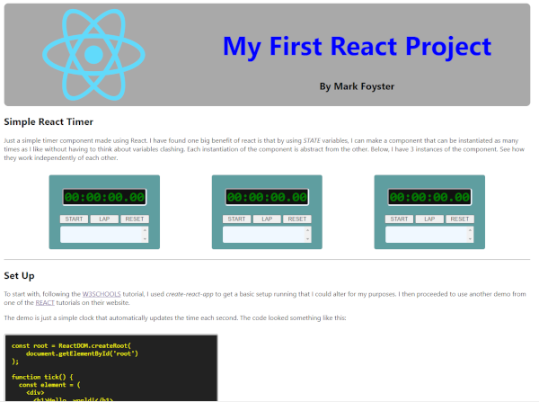

# firstReactProject
## A simple timer component

As my first React project, I chose to make a simple Timer component. The project has it's own website (also in React) which explains the code and is hosted as a static site [HERE](https://first-react.markfoyster.co.uk/).

The timer component is created as an **ES6** Class style component and is self contained (Excluding css) as a module that makes for easy importing into other React components / projects.

Overall, it's my first React project, I've learnt a lot and have no regrets. There is still much room for improvement. I still have a lot to learn.

I'm loving the whole compononent centric style approach to React. It make it easier to create truly Abstract code that is easy to re-purpose later.