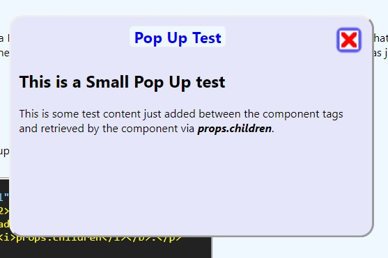

# firstReactProject

## Details

This is my playground to learn some of the React basics. The project has it's own website (also in React) which explains the code and is hosted as a static site [HERE](https://first-react.markfoyster.co.uk/). The development environment was *Create-React-App* which I love for it's simplicity. furthermore, the "boiler plate" code is not too excessive and is straightforward to understand and modify. 

## Screen Shot

## The Timer Component

My first React component, I chose to make a simple Timer. I took a very simple clock demo from the React website, adapted and built upon it.

It's a Class style component and is self contained (Excluding css) as a module for easy importing into other React components / projects.

Overall, as my first React project, I learnt a lot and have no regrets. There is still much room for improvement, I still have a lot to learn.

I'm loving the whole component centric style approach to React. It make it easier to create truly Abstract code that is easy to re-purpose later.

## The Pop Up Component

Modelled after the Pop Up component in my conventional component library, it seemed a natural progression to make a React version.

This time I went with a functional component in order to help with my understanding of hooks.

## Additional content

I have added a simple menu that separates the middle content into components allowing React to swap it out for a 'Multi Page' style website without a complete reload.

The pages include

- *Code Review* page that briefly discusses some of the concepts I have learnt through this project.

- *Other Stuff* page which for now imports and displays some data from a MySql database using an API from another project. 

